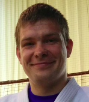

# Reinforcement learning workshop

Materials and organization for the upcoming RL workshop.

**UPDATE**

Workshop has been postponed until November because of organizer's workload. Participants have been notified by e-mail. We will specify a new date later. Thanks for understanding.

Sign up form is now closed. 

<!-- https://goo.gl/forms/WjooHybP8dEwiGX93 -->

If you would like to come to help us out, don't hesitate to contact us :)
Thanks!

Official website (for now it redirects here to github): http://lectures.ai

## Why reinfocement learning?

> Reinforcement learning is hot! You may have noticed that computers can now automatically learn to play ATARI games (from raw game pixels!), they are beating world champions at Go, simulated quadrupeds are learning to run and leap, and robots are learning how to perform complex manipulation tasks that defy explicit programming. It turns out that all of these advances fall under the umbrella of RL research.
> https://karpathy.github.io/2016/05/31/rl/

## Date & place

November 12th 2016 (yet to be confirmed), FIT ČVUT, room 350

## Program

Main organizer: MS, assisting: JZ

Saturday workshop is all about reinforcement learning (RL).
 
There will be competition amongst the participants to create the best algorithm for a given task, with a small award :-)

### What is reinforcement learning?

Reinforcement learning is an area of machine learning inspired by behaviorist psychology, concerned with how software agents ought to take actions in an environment to maximize some notion of a cumulative reward.

Take a look at this two-minute-paper which nicely summarizes recent publications:

Usually the agent doesn't have any prior knowledge about the environment and through exploration of the environment and exploitation of his knowledge about it he finds a policy to take the most cumulatively rewarding actions.

In machine learning, the environment is typically modeled as a Markov decision process (MDP) as many reinforcement learning algorithms utilize dynamic programming techniques.
 
Q-learning is a model-free reinforcement learning technique. Q-learning can be used to find an optimal action-selection policy for any given (finite) Markov decision process (MDP)

A recent application of Q-learning to deep learning, by Google DeepMind, titled "deep reinforcement learning" or "deep Q-networks", has been successful at playing some Atari 2600 games at expert human levels. They are games such as [Space Invaders](https://www.youtube.com/watch?v=437Ld_rKM2s), [Pong](https://www.youtube.com/watch?v=moqeZusEMcA), [Breakout](https://www.youtube.com/watch?v=QIs3UOTdsJM) and others.

Deep reinforcement learning has very interesting real-world applications besides game playing. In July, 2016, [DeepMind announced](https://deepmind.com/blog) they reduced google data center electricity cooling bill by 40%, which is a huge saving on costs and the environment.

You can look forward to learn about basics of RL, recent papers and get hand-on experience with RL by training algorithms on GPUs.

### Workshop details
We will go through necessary theory and basics in the morning. In the afternoon we will focus on solving problems from OpenAI Gym and train RL models on GPUs.

### Timetable:

| Time            | Activity               |
|-----------------|------------------------|
| 9:00 - 10:30    | Basics with TensorFlow 
| 10:30 - 12:00   | Theory for RL
| *12:00 - 13:00* | *Lunch break* 
| 13:00 - 16:30   | Tutorials
| *16:30 - 17:00* | *Coffee break*
| 17:00 - 20:00   | Competition coding
| 20:00 - 21:00   | Finalizing the day
| 20:00 - 09:00   | Running models all night long

### Competition
Details about the competition are to be be specified.

## Sponsor

We'd like to thank our sponsor, Blindspot solutions, for providing us pizzas and prizes.

## Necessary prerequisites for participants

For the workshop to run effectively, participants should:

- be proficient at programing in Python
- have taken courses on probability & statistics, linear algebra and mathematical analysis

It is a plus if you had taken a courwse in Optimization/Biologically inspired algorithms/Planning
  
If you don't know python, please learn some basics - there's a lot materials available online and it is quite a simple language.

## Organizers

Michal Šustr (MS)

- [homepage](http://michal.sustr.sk/) 
- [twitter](https://twitter.com/michal_sustr)

Ján Zikeš (JZ)
    
- [about me](https://about.me/zikesjan)

Co-organizers:

- https://www.fit.cvut.cz/
- http://datalab.fit.cvut.cz/

